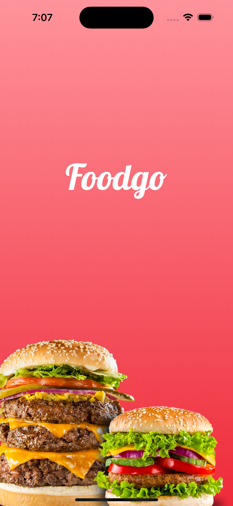
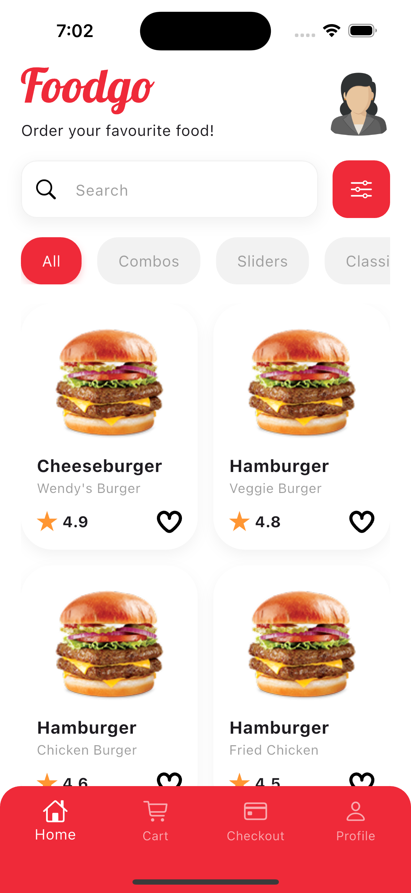
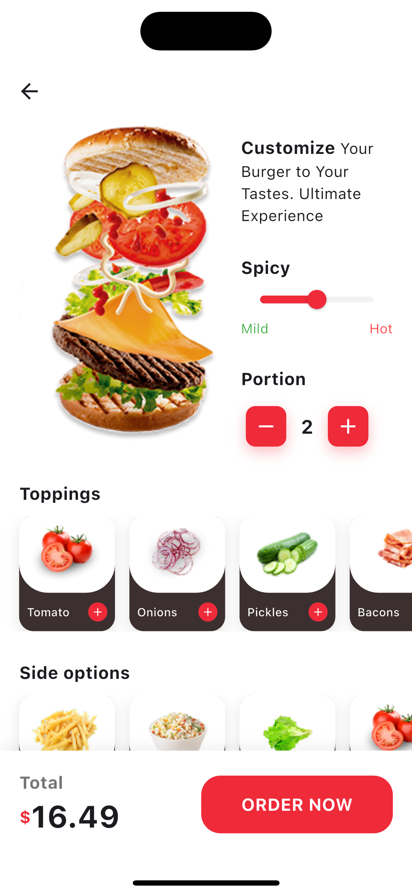
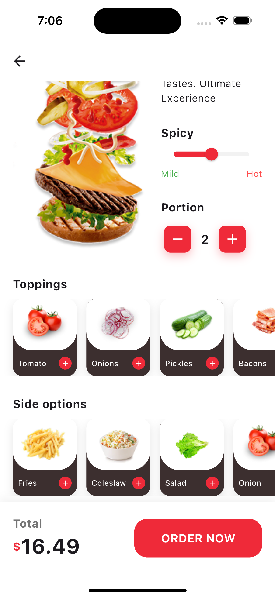

# FoodGo 🍔

FoodGo is a premium, modern food delivery application built with Flutter. It features a sleek, responsive UI designed to provide a seamless user experience, from browsing delicious categories to selecting the perfect burger.

## ✨ Features

- **Dynamic Home Screen**: A clean and intuitive dashboard to explore top-rated food.
- **Categorized Browsing**: Quickly filter through various food types like Burgers, Pizza, Classics, and more.
- **Premium Food Cards**: Beautifully designed cards featuring high-quality images, star ratings, and quick "favorite" toggles.
- **Search & Filter**: Find exactly what you're craving with a modern search interface and filter controls.
- **Interactive Product Customization**: Adjust spicy level and portions with intuitive, styled controls.
- **Scrollable Toppings & Sides**: Select from a variety of ingredients with a sleek, horizontal scrolling interface and dark-themed cards.
- **Dynamic Sticky AppBar**: Sophisticated header transition from transparent to solid white upon scrolling for improved readability.
- **Persistent Order Bar**: Fixed footer for immediate access to total price and checkout action.
- **Modular Architecture**: Clean, reusable widget structure for high maintainability.


## 📁 Project Structure

The project follows a modular and clean architecture pattern:

```text
lib/
├── Core/
│   ├── Helpers/       # Utility classes (Spacing, etc.)
│   ├── Theme/         # Design system (Colors, Images, TextStyles)
│   └── Shared/        # Project-wide reusable components
└── Features/
    ├── Home/
    │   ├── Screens/   # Main Home View
    │   └── Widgets/   # Modular components (FoodCard, HomeHeader, etc.)
    ├── Product/
    │   ├── Screens/   # Product Details View
    │   └── Widgets/   # Customization, Options, and Order Bar widgets
    └── Intro/         # Navigational roots and onboarding
```
## 📸 UI Preview

| Splash Screen | Home Screen | Product Details | Product Options |
| :---: | :---: | :---: | :---: |
|  |  |  |  |

---
## 🛠️ Technology Stack

- **Framework**: [Flutter](https://flutter.dev/)
- **Language**: [Dart](https://dart.dev/)
- **Typography**: [Google Fonts - Poppins](https://fonts.google.com/specimen/Poppins)
- **Icons & Assets**: Custom SVG integration using `flutter_svg`.
- **Responsive Design**: `flutter_screenutil`

## 🚀 Getting Started

1. **Clone the repository**:
   ```bash
   git clone https://github.com/salma-elmaghawry/FoodGo-App.git
   ```

2. **Install dependencies**:
   ```bash
   flutter pub get
   ```

3. **Run the app**:
   ```bash
   flutter run
   ```


Developed with ❤️ by [Salma Elmaghawry](https://github.com/salma-elmaghawry)
